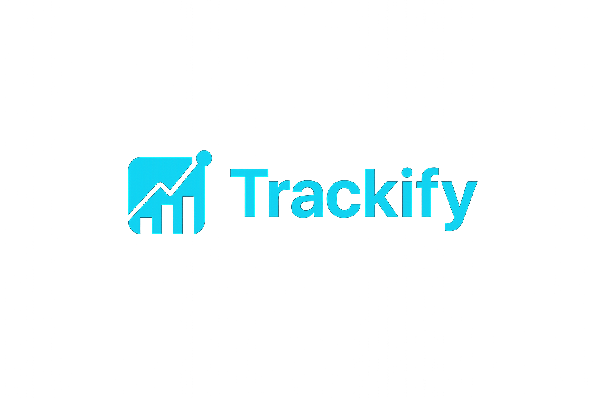

# My Startup



## 🚀 About the Project

My Startup is a modern web-based platform designed to simplify daily workflows and make life easier for users.  
It is built with **React**, **Node.js**, and other cutting-edge technologies to ensure high performance, scalability, and a smooth user experience.

## ✨ Features

- Simple and intuitive UI
- Fast and reliable performance
- Scalable architecture for future growth
- Secure and user-friendly system

## 🛠️ Tech Stack

- **Frontend:** React, Vite, Ant Design, TailwindCSS
- **Backend:** Node.js, Express
- **Database:** PostgreSQL / MongoDB (depending on deployment)
- **Deployment:** Render / Vercel / Docker

## 📦 Installation

1. Clone the repository:
   ```bash
   git clone https://github.com/your-username/your-startup.git
   ```
